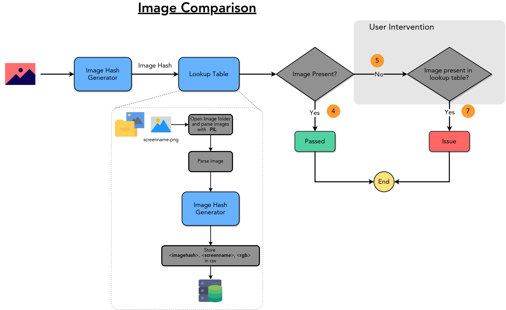

============
imagecompare
============

Description
===========

imagecomare is the software which takes image as input and generates the image hash and
comppares that hash with the lookup table to check if the image is already present or not
as output it returns the name of the image from the lookup table.

Note
====

Major two parts of implementation
- Lookup table
    - database of <imagehash>:<imagename>:<imagedata>
    - database will be hdf5
    - api interface for the lookuptable

- Image compare

Lookup Table
============

The main lookup table should be able to generate the table and also able to open it if the file exists.
- If the file exists then assert the path of the file and open it and return the functions to play with the file.
- If the file dont exists then user has to provide the flag to generate the file and assert the image folder path

- generate 
- lookup the table for the image hash
- update the table with new image
- check if an item is present in the table
- get the item from the table. 
- remove the item from the table

Image Hash
==========

Using imagehash package for generating the image hash. this package is not used as a module but rather as a file which is copied.
My plan is to implement image hashing algorithm in Rust/C just for sake of learning and use those.

Observations
============

- From the big data, the image 00628 and 00010 are generating the same average hash
- TODO: Need to go into the details that why average hash is generating the same hash value for these images.
- These images were of 128x128. Check by taking the same images of 1024x1024 and see if the image hash is still same.
